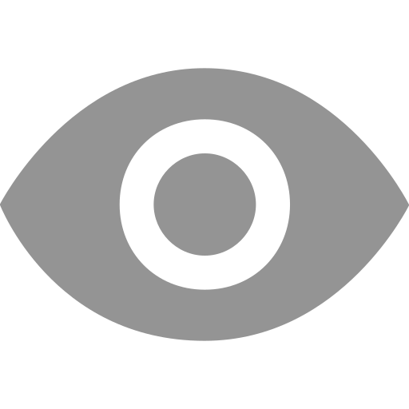
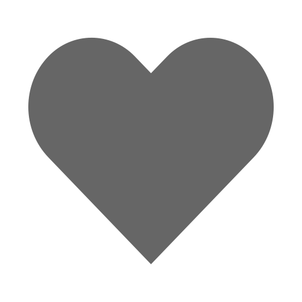

# Drrible-Clone

## Description
The provided HTML and CSS code creates a Dribbble-inspired web page for showcasing designers' work. The header features a logo, navigation menu (Shots, Designers, Teams, Community, Jobs), sign-up and sign-in links, 
and a search bar. The main section includes a filter bar with a prompt and description, plus links for "Learn more" and "Sign up". A responsive grid displays various design shots, each with an image, stats (views, 
comments, likes), and the author's name. The CSS styles the body with a light gray background, the header with a dark background and white text, and the filter bar with centered text and dark gray background. The 
shots grid has a clean, modern look with white backgrounds, light gray borders, and subtle shadows for each item. This code offers a visually appealing and user-friendly layout for a design showcase site.

## PROGRAM
### HTML
```html
<!DOCTYPE html>
<html lang="en">
<head>
    <meta charset="UTF-8">
    <meta name="viewport" content="width=device-width, initial-scale=1.0">
    <title>Dribbble</title>
    <link rel="stylesheet" href="styles.css">
</head>
<body>
    <header>
        <div class="header-left">
            <div class="logo">Dribbble</div>
            <nav>
                <ul>
                    <li><a href="#">Shots</a></li>
                    <li><a href="#">Designers</a></li>
                    <li><a href="#">Teams</a></li>
                    <li><a href="#">Community</a></li>
                    <li><a href="#">Jobs</a></li>
                </ul>
            </nav>
        </div>
        <div class="header-right">
            <div class="auth">
                <a href="#">Sign up</a>
                <a href="#">Sign in</a>
            </div>
            <input type="text" placeholder="Search">
        </div>
    </header>
    <main>
        <div class="filter-bar">
            <div class="filter-elements">
                <h4 style="color: white">What are you working on?</h4>
                <h4 style="color: rgb(120, 117, 114);">&nbsp;Dribbble is show and tell for designers.</h4>
            </div>
            
            <div class="filter-options">
                <a href="#">Learn more</a>
                <a href="#" class="btn-signup">Sign up</a>
            </div>
        </div>
        <div class="shots-grid">
            <div class="shot-item">
                
                <div class="shot-info">
                    <div class="shot-stats">
                        <span>&nbsp;4,044</span>
                        <span>&nbsp;14</span>
                        <span>&nbsp;290</span>
                    </div>
                    <div class="shot-author">
                        <a href="#">Famous</a>
                    </div>
                </div>
            </div>
            <div class="shot-item">
                
                <div class="shot-info">
                    <div class="shot-stats">
                        <span>&nbsp;2,404</span>
                        <span>&nbsp;13</span>
                        <span>&nbsp;236</span>
                    </div>
                    <div class="shot-author">
                        <a href="#">Balkan Brothers</a>
                    </div>
                </div>
            </div>
            <div class="shot-item">
                
                <div class="shot-info">
                    <div class="shot-stats">
                        <span>&nbsp;3,985</span>
                        <span>&nbsp;17</span>
                        <span>&nbsp;264</span>
                    </div>
                    <div class="shot-author">
                        <a href="#">Jan Losert</a>
                    </div>
                </div>
            </div>
            <div class="shot-item">
                
                <div class="shot-info">
                    <div class="shot-stats">
                        <span>&nbsp;2,602</span>
                        <span>&nbsp;23</span>
                        <span>&nbsp;186</span>
                    </div>
                    <div class="shot-author">
                        <a href="#">Mattias Johansson</a>
                    </div>
                </div>
            </div>
            <div class="shot-item">
                
                <div class="shot-info">
                    <div class="shot-stats">
                        <span>&nbsp;2,389</span>
                        <span>&nbsp;8</span>
                        <span>&nbsp;178</span>
                    </div>
                    <div class="shot-author">
                        <a href="#">Ruslan Siiz</a>
                    </div>
                </div>
            </div>
            <div class="shot-item">
                
                <div class="shot-info">
                    <div class="shot-stats">
                        <span>&nbsp;2,025</span>
                        <span>&nbsp;6</span>
                        <span>&nbsp;160</span>
                    </div>
                    <div class="shot-author">
                        <a href="#">Paperpillar</a>
                    </div>
                </div>
            </div>
            <div class="shot-item">
                
                <div class="shot-info">
                    <div class="shot-stats">
                        <span>&nbsp;1,841</span>
                        <span>&nbsp;6</span>
                        <span>&nbsp;158</span>
                    </div>
                    <div class="shot-author">
                        <a href="#">Alfrey Davilla</a>
                    </div>
                </div>
            </div>
            <div class="shot-item">
                
                <div class="shot-info">
                    <div class="shot-stats">
                        <span>&nbsp;2,179</span>
                        <span>&nbsp;6</span>
                        <span>&nbsp;158</span>
                    </div>
                    <div class="shot-author">
                        <a href="#">A Studio-JQ</a>
                    </div>
                </div>
            </div>
        </div>
    </main>
</body>
</html>
```

### CSS
```css
body {
    font-family: Arial, sans-serif;
    margin: 0;
    padding: 0;
    background-color: #f8f8f8;
}

header {
    display: flex;
    justify-content: space-between;
    align-items: center;
    background-color: #333;
    color: white;
    padding: 10px 20px;
}

.header-left {
    display: flex;
    align-items: center;
}

.logo {
    font-size: 1.5em;
    margin-right: 20px;
}

nav ul {
    list-style-type: none;
    margin: 0;
    padding: 0;
    display: flex;
}

nav ul li {
    margin: 0 15px;
}

nav ul li a {
    color: white;
    text-decoration: none;
}

.header-right {
    display: flex;
    align-items: center;
}

.auth a {
    color: white;
    text-decoration: none;
    margin-left: 15px;
}

.header-right input[type="text"] {
    padding: 5px;
    margin-left: 20px;
    border: none;
    border-radius: 3px;
}

.filter-bar {
    background-color: #413f3f;
    padding: 20px;
    text-align: center;
}

.filter-bar p {
    margin: 0;
    font-size: 1.2em;
}

.filter-elements
{
    display: flex; 
    justify-content:center;
}

.filter-options a {
    margin-left: 20px;
    background-color: #a29f9f;
    color: white;
    padding: 10px 15px;
    border-radius: 5px;
    text-decoration: none;
    font-weight: bold;
}

.filter-options .btn-signup {
    background-color: #ff4081;
    color: white;
    padding: 10px 15px;
    border-radius: 5px;
    text-decoration: none;
}

.shots-grid {
    display: grid;
    grid-template-columns: repeat(auto-fill, minmax(300px, 1fr));
    gap: 20px;
    padding: 20px;
}

.shot-item {
    background-color: white;
    border: 1px solid #ddd;
    border-radius: 8px;
    overflow: hidden;
    box-shadow: 0 2px 4px rgba(0, 0, 0, 0.1);
}

.shot-item img {
    width: 100%;
    height: auto;
}

.shot-info {
    padding: 10px;
}

.shot-stats {
    display: flex;
    justify-content: space-between;
    color: #a09a9a;
}
.shot-stats img{
    width: 18px;
    height: 18px;
}
.shot-author a {
    color: #64bfe7;
    text-decoration: none;
    font-weight: bold;
}
```

### OUTPUT


